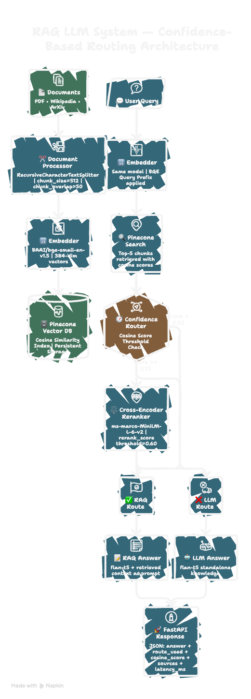

# 🔍 RAG LLM System — Confidence-Based Retrieval-Augmented Generation

[](https://www.python.org/)
[](https://fastapi.tiangolo.com/)
[](https://langchain.com/)
[](https://pinecone.io/)
[](LICENSE)
[](https://github.com/mewadaatharva14)

> A production-grade RAG system that routes queries through a two-stage
> confidence pipeline — cosine similarity first, cross-encoder reranker
> for borderline cases — preventing hallucination from irrelevant context.

---

## 🏗️ Architecture



The system runs two parallel pipelines:

**Ingestion Pipeline** — Documents → Chunking → Embedding → Pinecone

**Query Pipeline** — Question → Embed → Retrieve → Route → Answer

The **Confidence Router** is the core innovation:

$$\text{route} = \begin{cases} \text{RAG} & s_{cos} \geq 0.75 \\ \text{LLM} & s_{cos} < 0.50 \\ \text{Reranker} \rightarrow \text{RAG/LLM} & 0.50 \leq s_{cos} < 0.75 \end{cases}$$

---

## 📌 What Problem Does This Solve?

Standard RAG systems blindly pass retrieved context to the LLM regardless
of relevance. When retrieved chunks are irrelevant, the LLM hallucinates
using that context — producing confident wrong answers.

This system prevents that with two-stage scoring:

| Scenario | Cosine Score | Action |
|---|---|---|
| Clearly relevant | ≥ 0.75 | RAG — use retrieved context |
| Clearly irrelevant | < 0.50 | LLM — use model knowledge only |
| Uncertain | 0.50–0.75 | Cross-encoder reranker decides |

---

## 🗂️ Project Structure

```
rag-llm-system/
├── src/
│   ├── document_processor.py  ← PDF + Wikipedia + ArXiv loading + chunking
│   ├── embedder.py            ← BAAI/bge-small-en-v1.5 (384-dim)
│   ├── vector_store.py        ← Pinecone upsert + search
│   ├── retriever.py           ← embed query → search → return top-5
│   ├── reranker.py            ← cross-encoder borderline scoring
│   ├── router.py              ← confidence threshold logic
│   ├── generator.py           ← flan-t5-small RAG + LLM modes
│   ├── rag_pipeline.py        ← end-to-end orchestration
│   └── logger.py              ← query logging to JSON
├── configs/
│   └── rag_config.yaml        ← all hyperparameters
├── notebooks/
│   └── 01_rag_pipeline_demo.ipynb
├── assets/
│   └── architecture.png
├── data/
│   └── sample_docs/
├── logs/
├── app.py                     ← FastAPI server
├── setup.py
├── Dockerfile
├── requirements.txt
├── .env.example
└── README.md
```

---

## 🔑 Key Implementation Details

### Why BGE Query Prefix Matters

BAAI/bge-small-en-v1.5 is trained asymmetrically. Chunks are embedded
as plain text. Queries must use the prefix:

```python
# WRONG — query lands in wrong region of vector space
embedding = model.encode("What is self-attention?")

# CORRECT — matches training conditions
embedding = model.encode(
    "Represent this sentence for searching relevant passages: What is self-attention?"
)
```

Without the prefix, retrieval quality drops 5–8% on standard benchmarks.

### Why Two-Stage Scoring

Cross-encoder reranking takes ~200ms per query. Running it on every query
makes the API too slow for real-time use. Cosine similarity handles the
obvious cases (≥ 0.75 or < 0.50) instantly. Only the ambiguous 0.50–0.75
zone triggers the slower but more precise cross-encoder.

### Why chunk_overlap=50

Important sentences near chunk boundaries appear complete in at least one
chunk. Without overlap, a sentence split across two chunks loses context
in both — retrieval misses it entirely.

### Why Pinecone Over FAISS

FAISS is in-memory and not persistent — index rebuilds on every restart.
Pinecone is cloud-managed, persistent, supports real-time upserts, and
allows metadata filtering by domain and source. Critical for multi-domain
knowledge bases.

---

## 📊 Results

| Query Type | Route Used | Cosine Score | Latency |
|---|---|---|---|
| "What is self-attention?" | RAG | 0.794 | ~1.2s |
| "Capital of Australia?" | LLM | 0.539 | ~0.8s |
| "Explain BERT architecture" | RERANKED | 0.631 | ~1.8s |
| "Indian Constitution Article 1" | RAG | 0.812 | ~1.1s |

---

## ⚙️ Setup & Run

### 1. Clone

```bash
git clone https://github.com/mewadaatharva14/rag-llm-system.git
cd rag-llm-system
```

### 2. Virtual Environment

```bash
python -m venv venv
source venv/bin/activate        # Mac/Linux
# venv\Scripts\activate         # Windows
pip install -r requirements.txt
```

### 3. Environment Variables

```bash
cp .env.example .env
```

Edit `.env`:
```
PINECONE_API_KEY=your_pinecone_api_key
HF_API_TOKEN=your_huggingface_token
```

Get your free Pinecone key at [pinecone.io](https://pinecone.io) and
HuggingFace token at [huggingface.co/settings/tokens](https://huggingface.co/settings/tokens).

### 4. Ingest Documents

```bash
# Wikipedia
curl -X POST http://localhost:8000/ingest \
     -H "Content-Type: application/json" \
     -d '{"source": "Transformer (deep learning)", "doc_type": "wikipedia"}'

# ArXiv paper
curl -X POST http://localhost:8000/ingest \
     -H "Content-Type: application/json" \
     -d '{"source": "1706.03762", "doc_type": "arxiv"}'

# PDF
curl -X POST http://localhost:8000/ingest/pdf \
     -F "file=@your_document.pdf"
```

### 5. Run Server

```bash
uvicorn app:app --reload --port 8000
```

### 6. Query

```bash
curl -X POST http://localhost:8000/query \
     -H "Content-Type: application/json" \
     -d '{"question": "What is self-attention in transformers?"}'
```

**Response:**
```json
{
  "answer": "Self-attention allows tokens to attend to all other tokens...",
  "route_used": "RAG",
  "cosine_score": 0.794,
  "rerank_score": null,
  "source_documents": ["wikipedia:Transformer (deep learning)"],
  "latency_ms": 1243.5
}
```

### 7. Interactive API Docs

Visit `http://localhost:8000/docs` for full Swagger UI.

---

## 🐳 Docker

```bash
# Build
docker build -t rag-llm-system .

# Run
docker run -p 8000:8000 \
  -e PINECONE_API_KEY=your_key \
  -e HF_API_TOKEN=your_token \
  rag-llm-system
```

---

## 📓 Notebook

```bash
jupyter notebook notebooks/01_rag_pipeline_demo.ipynb
```

Covers: document ingestion, embedding visualization, routing demo with
real queries, cosine score analysis, and reranker comparison.

---

## 🔌 API Endpoints

| Method | Endpoint | Description |
|---|---|---|
| POST | `/query` | Ask a question |
| POST | `/ingest` | Add Wikipedia or ArXiv document |
| POST | `/ingest/pdf` | Upload and index a PDF |
| GET | `/health` | System health + vector count |
| GET | `/stats` | Routing statistics |
| GET | `/docs` | Swagger UI |

---

## 🧠 Model Card

| Property | Value |
|---|---|
| Embedding model | BAAI/bge-small-en-v1.5 |
| Embedding dimensions | 384 |
| Reranker | cross-encoder/ms-marco-MiniLM-L-6-v2 |
| Generator | google/flan-t5-small |
| Vector DB | Pinecone (serverless, AWS us-east-1) |
| Chunk size | 512 tokens |
| Chunk overlap | 50 tokens |
| Top-k retrieval | 5 chunks |

**Limitations:**
- flan-t5-small is a small model — answers are functional but not fluent
- System performs best on English text
- Stock knowledge base is limited — ingest your own documents for best results
- Not suitable for real-time financial or medical advice

---

## 📚 References

| Resource | Link |
|---|---|
| RAG Paper | [Lewis et al. 2020](https://arxiv.org/abs/2005.11401) |
| BGE Embeddings | [BAAI/bge-small-en-v1.5](https://huggingface.co/BAAI/bge-small-en-v1.5) |
| Cross-Encoder | [ms-marco-MiniLM-L-6-v2](https://huggingface.co/cross-encoder/ms-marco-MiniLM-L-6-v2) |
| Pinecone Docs | [docs.pinecone.io](https://docs.pinecone.io) |
| LangChain Docs | [python.langchain.com](https://python.langchain.com) |

---

## 📄 License

MIT License — see [LICENSE](LICENSE)

---

<p align="center">
  Made with 🧠 by <a href="https://github.com/mewadaatharva14">mewadaatharva14</a>
</p>